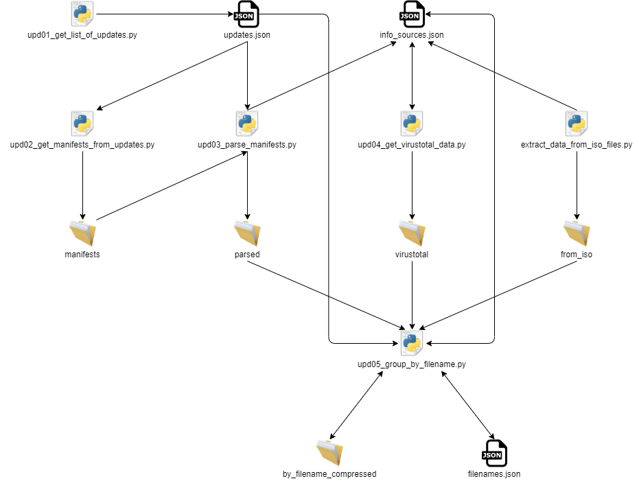

# winbindex-data-arm64

This repository hosts the indexed data of Windows ARM64 builds for Winbindex,
and updates it on a regular basis with GitHub Actions.

## Winbindex

Winbindex is an index of Windows binaries, including download links for
executables such as exe, dll and sys files. For details please refer to [the
main repository](https://github.com/m417z/winbindex).

## Flow of scripts

